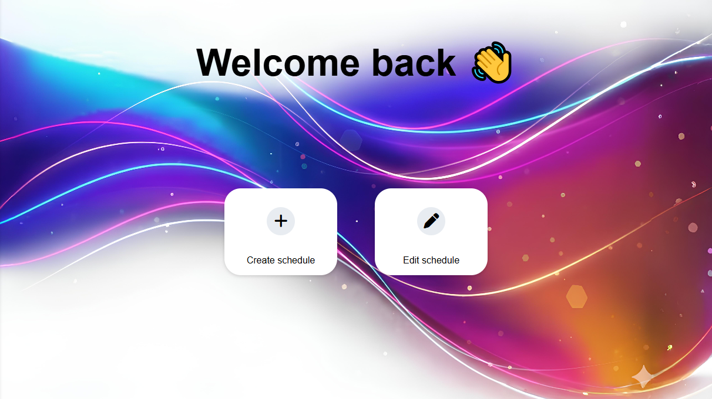
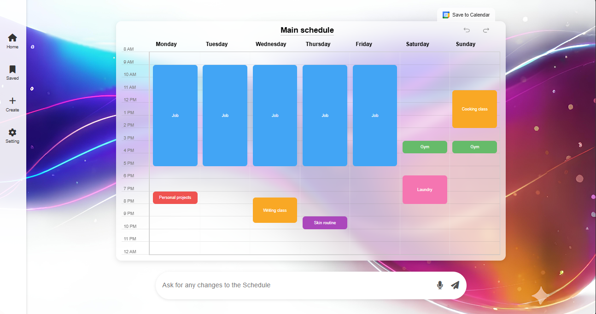
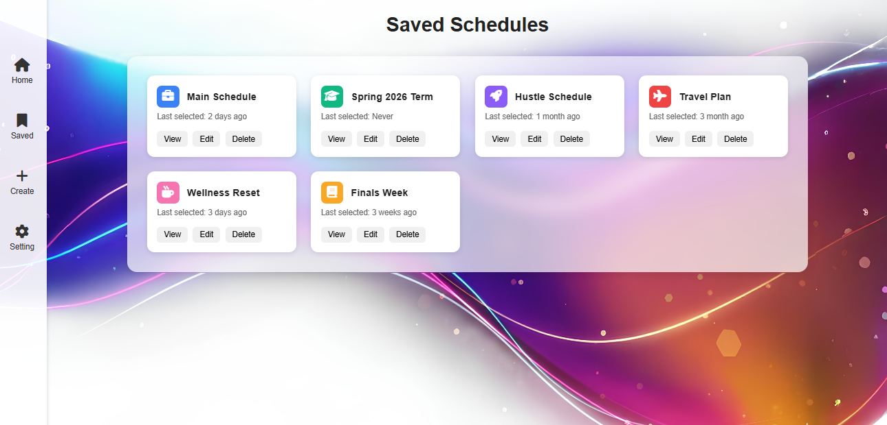
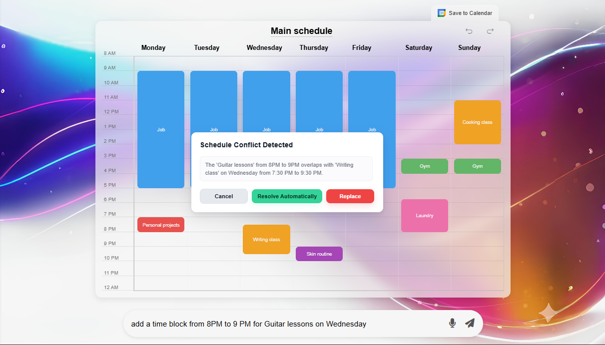

# Tamie 
> *Your personal time architect — generate, customize, and optimize your life schedule.*

<br>

---

## 🌟 Overview  
**Tamie** is an Ai driven web app that helps create adaptable,clear,fast Schedules.  
Instead of manually setting up a calendar, simply answer a short survey and let the system auto-generate a personalized weekly schedule that can be further customized.  

Once your schedule is created, an integrated AI assistant helps you **tweak, rebalance, or optimize** it dynamically with natural language commands like:
> “I feel tired on Wednesdays — move my laundry day.”  
> “Find me time to write one page a day.”  
> “Shift my gym sessions to mornings instead.”

---

## ⚙️ Core Features  

### 📝 Smart Onboarding Survey  
- Answer simple questions about your **commitments**, **goals**, and **energy levels**.  
- Automatically generates a realistic, balanced weekly schedule.  
- Optional “invisible buffers” for meals and commutes keep things realistic without cluttering the view.  

---

### 🤖 AI Chat Assistant  
- Ask the built-in chatbot to modify your schedule naturally.  
- LLM-powered reasoning ensures realistic rescheduling based on your habits, time constraints, and energy windows.  

Example:
```plaintext
User: I want to start writing a book.  
AI: I found a 30-minute window after dinner three days a week — want me to add it?
```

### 🔄 Dynamic Optimization  
- The system **learns from your real behavior** — what you skip, what you complete, and when you’re most productive.  
- Offers **smart suggestions** like:
  - “You tend to miss evening study sessions — move them to mornings?”
  - “You work best after 9 AM — shift deep work blocks later.”  
- Optional analytics and progress tracking show how your time use evolves.  
- Includes a **strictness slider** to toggle between flexible and fixed schedules.  


---

## 🧰 Tech Stack  

| Layer | Tools |
|-------|-------|
| **Frontend** | React (Next.js), Tailwind CSS |
| **Backend** | Node.js / Express |
| **Database** | Supabase (PostgreSQL) |
| **AI Integration** | OpenAI GPT-4o (structured JSON schedule generation) |
| **Auth & Storage** | Supabase Auth, Local Storage |
| **Optional Integrations** | Google Calendar API, Notion Sync, iCal Export |

---

## 🖼️ Image Gallery 

<table align="center">
  <tr>
    <td align="center">
      <br>
      <b>Survey Flow</b>
    <td align="center">
      <br>
      <b>Schedule Overview</b>
    </td>
  </tr>
  <tr>
    <td align="center">
      <br>
      <b>Saved Dashboard</b>
    </td>
    <td align="center">
      <br>
      <b>Conflict handeling</b>
    </td>
  </tr>
</table>
